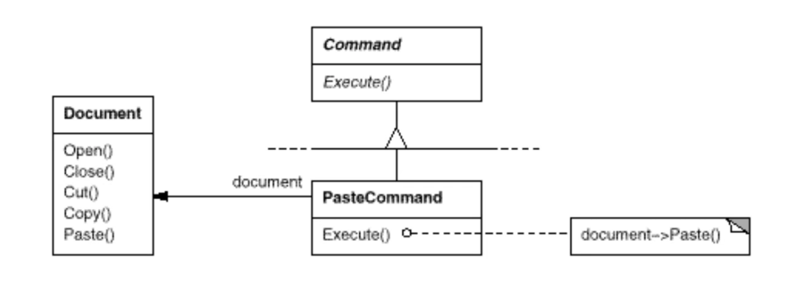

# **Problem:要如何分配物件的責任以便解除呼叫者與接收者原本緊密耦合的關係?**

## ==何時可以套這個pattern?? ==希望做undo 或 logging 時。

- 不要把應用邏輯直接寫在圖形介面上(MenuItem)。所以我們希望把它參數化，==把對象跟動作綁成一個物件== 。
- MenuItem每次Clicked時，就會執行command。

- Document是receiver, 所以pasteCommand可以call document的Paste()。

- Macro可以設定一連串的指令like 置中和粗體字等等。
- MacroCommand和Command之間的關係是Composite.([[Composite]])

## ==Command的pros and cons==
-  pros
	- command可以方便logging因為可以直接把物件存起來。
	- 方便undo，必須有某種回存的機制。
- cons
	- Its indirection，間接做到這些動作。

## Structure

- MenuItem是Invoker。
- Document是Receiver。(Client要知道Receiver)
- 虛線代表Construct。==(寫pattern時不會把建構元寫出來，這樣東西太多)==

## Participants
- Command
	- declares an interface for executing an operation.
- ConcreteCommand (PasteCommand, OpenCommand)
	- defines a binding between a Receiver object and an action.
	- implements Execute by invoking the corresponding operation(s) on Receiver.
- Client (Application)
	- creates a ConcreteCommand object and sets its receiver.
- Invoker(MenuItem)
	- asks the command to carry out the request.
- Receiver(Document, Application)
	- knows how to perform the operations associated with carrying out a request. Any class may server as a Receiver.

## Consequences

1. 過去是把邏輯全部放在invoker身上，現在把他們關係decouple。
2. 把Command升級成物件操作。
3. 像先前提到的macroCommand變成Composite的型態。
4. 加新的Command很容易，不用修改既有的classes。