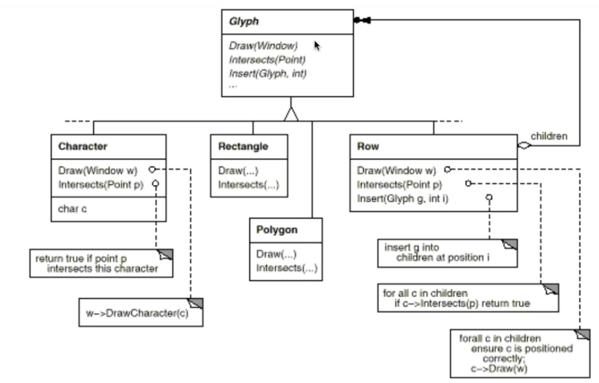

# **Problem:如何表達代表部分-整體的樹狀階層式結構?**

##課本第二章範例P.38

#### ==Glyphs have three basic responsibilities.==They know(1)how to draw themselves,(2)What space they occupy(3)their children and parent.
1. ==hit detection==代表使用者按滑鼠 OS會送一個座標給我。
2. ==structure==的method負責管理複雜的樹狀結構。
3. ==appearance==處理繪圖和面積計算。

在[[RDD]]中可以知道
1. appearance and hit detection屬於一個物件的computing,直接做的責任叫Computing。
2. structure是operation related to knowing知道最基本的責任是structure