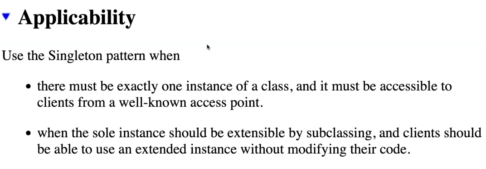
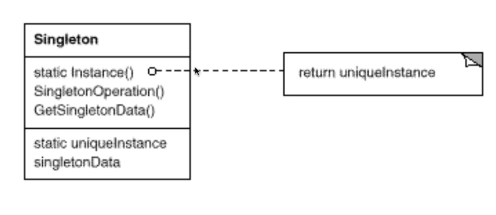
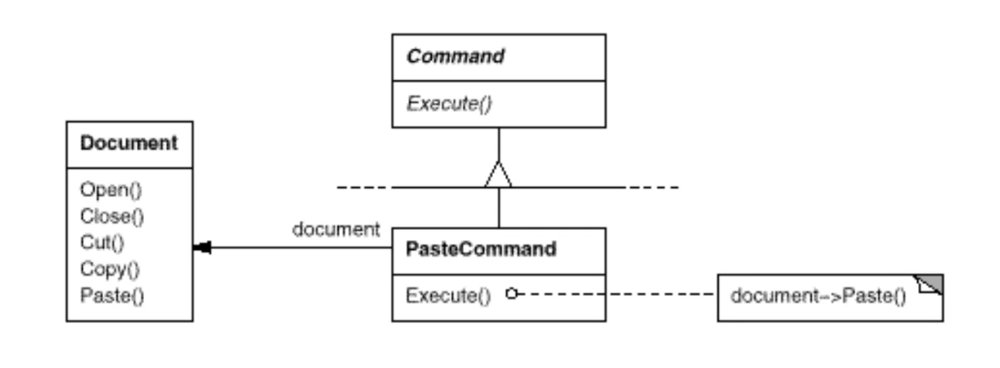

# **Problem:How to create a instance??**
## ==這個class最多只有一個instance。==

## 爭議: 放在Global很危險。會有Syncronization的問題(Race Condition)

## 甚麼時候要用??

- Well-known access point means ==global== 。

1. 不要讓任何人隨意呼叫Constructor，把constructor 設成private 可以管制不要讓其他人new。
2. 用Static Instance() 去生成唯一的instance。
3. static uniqueInstance 唯一的物件只能透過Instance()產生。
4. GetSingletonData()不能是static因為他是instance有儲存資料。

## 在[[Command]]的例子裏其實有imply Singleton

- 因為Document的Paste()沒有傳參數，代表我們要的東西是一個global的資料，也就是在Singleton身上。==(鄭老師的看法XD)==