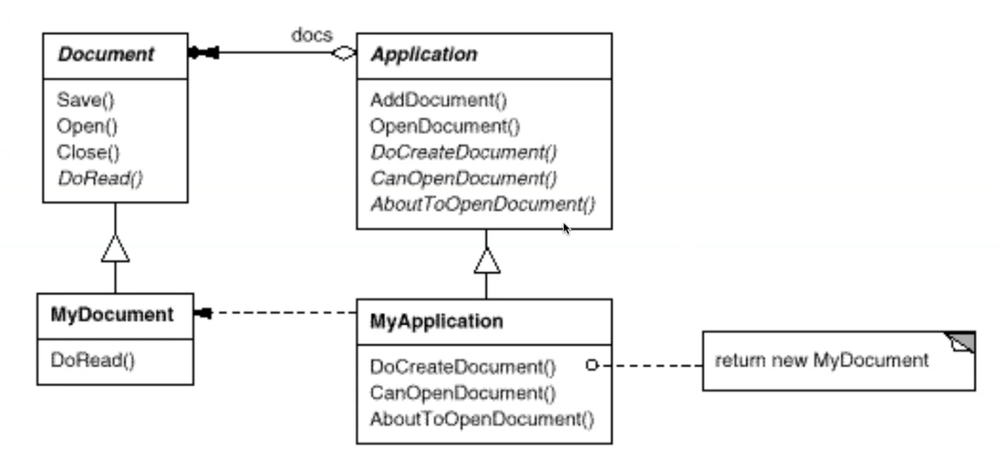
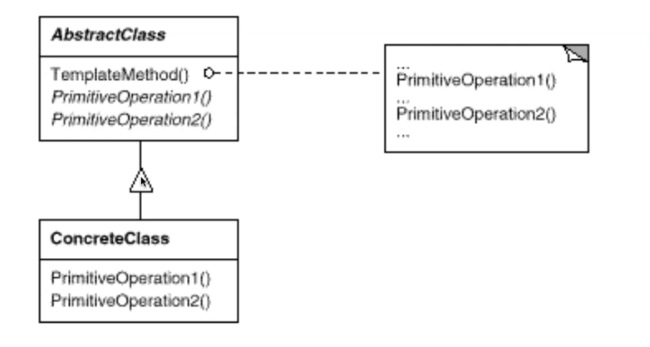
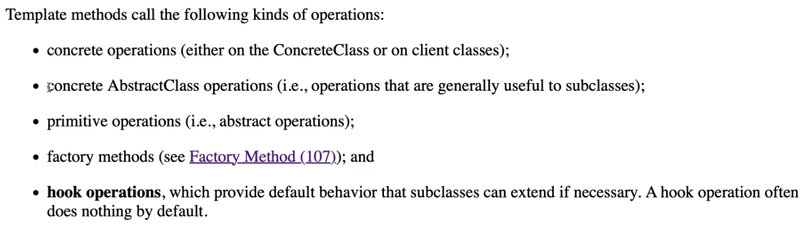

# **Problem:如何重複使用演算法骨架??**

- 正體字是Final，斜體字是希望有人override。

- ==PrimitiveOperation是斜體字，期待被override==
- don’t call us, we’ll call you. → framework 程式去 call 我們的程式。([Hollywood Principle](https://deviq.com/principles/hollywood-principle/))

- hook method他是一個non-final，看做是一個mini template method，可以不要在抽象層實作(給他空的實作內容)，但允許subclass實作它的細節。