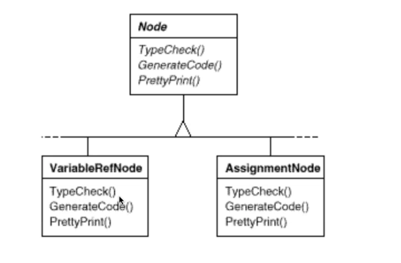
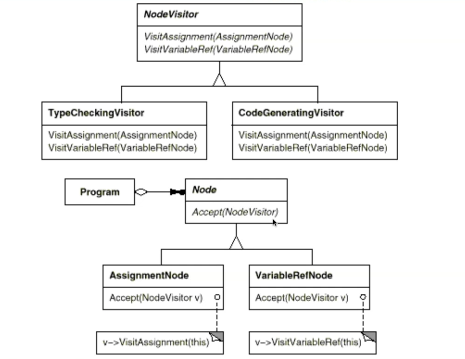
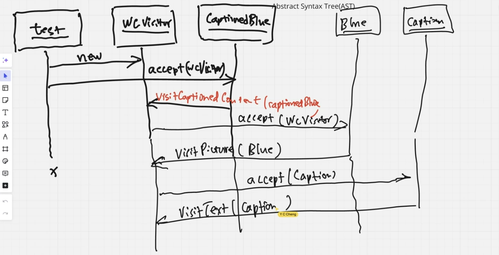
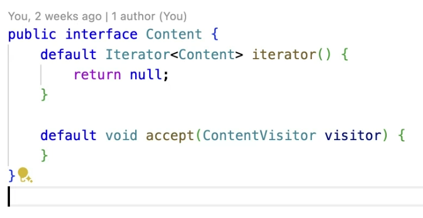

# **Problem:==如何將類別的行為和類別分離??==**

## 個人想法: 當Interface底下的concrete class都適用某個method時，就可以套Visitor，前提是這個interface職責太多才需要套如此複雜的pattern。

## Example

### Abstract Syntax Tree(AST)

- #### Compile程式首先要把資料結構建起來，每個節點都要TypeCheck檢查其資料型態(ex. assignment兩邊Type要一樣)。
- #### 每個節點都應該要CodeGen (ex. x86, asm)。
- #### PrettyPrint這個責任(功能)跟Compiler沒什麼關係。
- #### 設計問題: Node是吸收責任的地方，所以當你新增責任時，底下的每個節點都要新增。
#### ==一個class賦予太多責任就不易了解!==
- ##### SRP: 一個class只要賦予一個責任(不限只有一個責任)，它擔負的責任應該是同一類型(ex. Compilation相關責任)。
### Solution

-  #### 負的責任太多就要外包給別人做。(委外給專家做)
- #### 上面是visitor, 下面是被visit。
- #### Node把責任甩掉(accept讓visitor進來)，v→VisitAssignment把自己當參數給visitor。
- #### NodeVisitor number of method == number of concrete node.
- #### Node底下物件的method都不見了，責任外包。
### ==看別人的Code要從test case開始看(從concrete class看太細節不易懂)。==

### CaptionedContent的Sequence Diagram(理解物件之間的溝通關係)

### Consequence
- ==(代價)Breaking Encapsulation: 把concrete element的method給專家(visitor)使用。==
- 當你使用type casting(down cast)時，代表==polymorphism不見了==。但在visitCaptionedContent時，拿到的本來就是CaptionedContent所以可以直接call CaptionedContent本身的public method而不是只去透過Content<<Interface>>>去呼叫method。
- FindVisitor會讓物件產生side effect。因為
### ==利用Double-Dispatch取代polymorphism==
- Double-Dispatch:需要經過2個物件(Receiver)來決定最後執行哪個method(Content 、WordCountingVisitor)。

### setPosition責任問題??

- 在findVisitor我們需要用到set and get Position，那我們應該要把這個責任賦予給物件本身(ex. text，picture，captionedContent，hybridcontent)，如果composite的所有concrete class都需要這個method，那我們就應該把它(set and get Position)升級到Content(interface)才對。
- 我個人認為應該要從concrete class開始時做set and get Position，如果確定leaf and composite都需要才把他升級到interface上，因為它不一定是結構中所有物件的責任(說不定我的選擇太保守XD)。

- accept is a delegate responsibility、Iterator is a structure responsibility.[[RDD]]