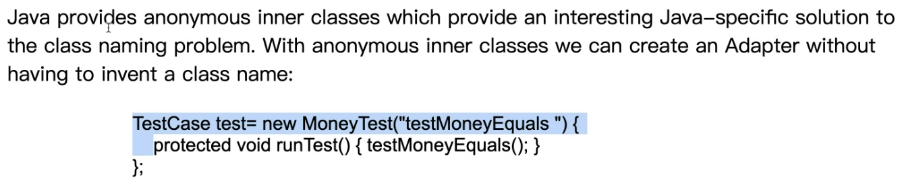

## [JUnit A Cook's Tour](<https://www.cs.cmu.edu/~pattis/15-1XX/common/zips/junit4.1/doc/cookstour/cookstour.htm>)
## ==使用Pattern一定是要解決設計問題，這些問題有大有小，套用Pattern應該從影響力最大的先!(YYC)==

- 每一個TestCase都是固定的演算法。重複使用這個流程、演算法，減少duplicate，並且defer implementation。

- 會宣告protected是為了只讓繼承他的人看到，其他人看不到。

- run這個method是final，因為流程或algorithm是固定的，不讓下面的subclass去override。

- 讓run接收一個參數，可記錄TestResult的failure。==this就是TestCase這個class==

- 每跑一個test，fRunTest可以加一。
- 加synchronized去防止race condition。

- collecting parameter，用TestResult去紀錄failure and error。
- finally是不管途中遭遇到甚麼exception，tearDown都會被執行。

- ==anonymous的好處就是不用每個TestCase的concreteClass都想名字。==

- 空白是因為這個class是anonymous。

- 用factory的方法去new一個TestSuite。==為甚麼要自己找所有測試???==

## Pattern Summary

- 第一個套的是Command，把TestCase做成Command。
- 當有測試失敗時可以套Collecting Parameter。
- TestCase有一定的流程(Template Method)。
- 和TestCase.run()不相容的class能夠runTest。
- 用reflection把每一個method去產生相對的物件。
- Composite不管有一個或數個都可以跑。

