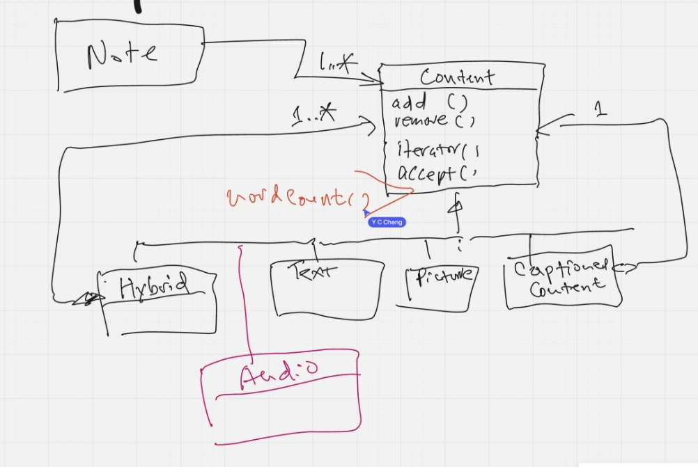
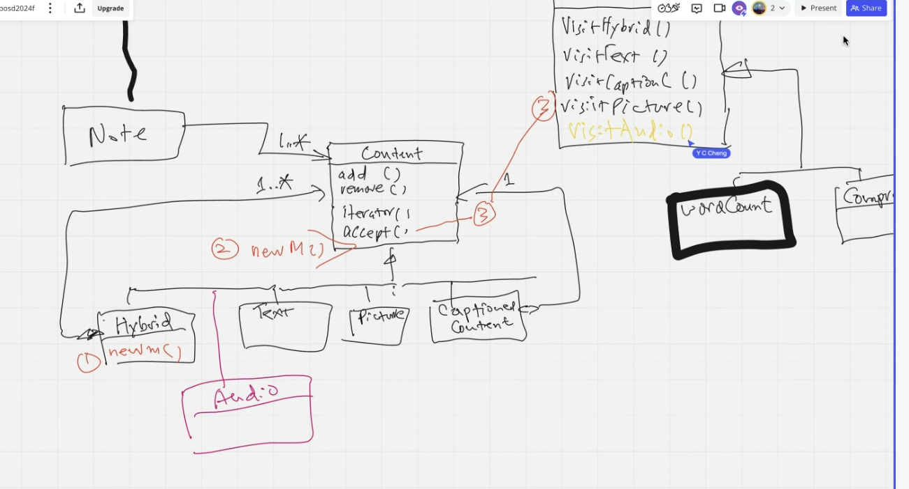

## 以下是在課程上的ocp的實際例子

### 如果我今天要在content上面加一個wordcount的功能，我要怎麼做才能不用讓每個concrete class去實作wordcount??

- A: 可以在Content上用default實作wordcount，這樣就不用去修改每個concrete class。
- 在Content底下的每個concrete class都應該是open for extension。
- 而Content(Abstract class)是close for modification。BTW，也要close for Note class，因為你如果改到client端客戶就不能使用此system。

### 如果我新增一個method，我弄壞了甚麼東西??
#### ==new method以下三種情況各自有缺點==
1. 直接加在Concrete class: 如果你直接在hybrid加wordcount而Content沒有，會因為要down casting而破壞polymorphism。==這意味著每新增一個concrete class就會破壞Note的closure==。
2. 加在Abstract class: 如果加在就要考慮Content上面的SRP，如果只有Picture能用這個method，其他的concrete class就只能吃interface上面的default method，這樣只是把問題轉移在Content身上。把Compile error的static checking轉移到Runtime error。
4. 套visitor pattern: 在composite的情況下，new operation(open for extension)是一個很棒的方法。==但每當你新增一個concrete class(ex. Audio)， 你的Visitor Interface就要有visitAudio的method，這樣會破壞Visitor的closure(永遠無法close)。==